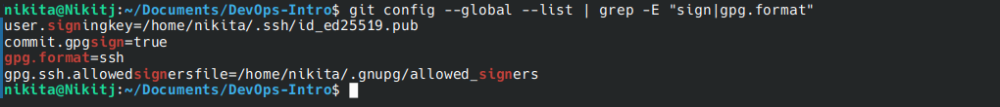
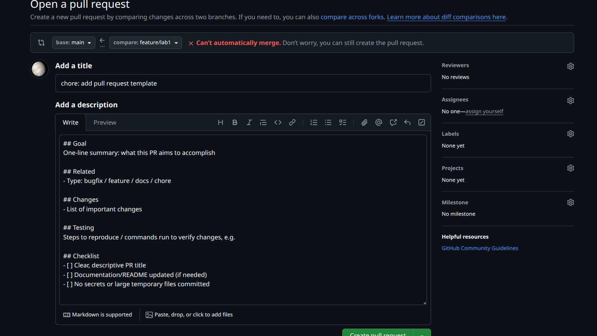
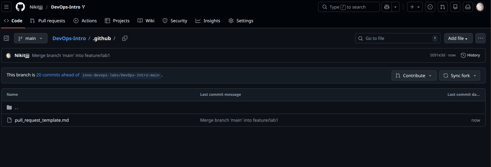

# Lab 1 DevOps & Git Workflow Submission

## Task 1 SSH Commit Signature Verification

### Why Commit Signing Matters
Commit signing is used to verify the authenticity and integrity of commits.
A signed commit proves that the changes were created by a trusted author
and were not altered after being pushed. In DevOps workflows, this helps
prevent impersonation, protects the codebase from tampering, and increases
trust in collaborative and CI/CD environments.

### SSH Setup Evidence
- An SSH key was generated and added to my GitHub account.
- Git was configured to use SSH for commit signing:
  - `gpg.format=ssh`
  - `commit.gpgSign=true`
  - `user.signingkey` set to the SSH public key.
- A signed commit was created and pushed successfully.

### Why Commit Signing Is Important in DevOps
Commit signing ensures accountability and trust by verifying the identity
of contributors. This is critical in DevOps workflows where automated
pipelines rely on the integrity of source code. Signed commits reduce the
risk of malicious code injection and help teams maintain secure and
auditable development practices.

### Verification

---

## Task 2 Pull Request Template & Checklist

### PR template auto-filling the description

### .github/pull_request_template.md exists on main branch

### How PR templates improve collaboration
Pull request templates standardize how changes are proposed and reviewed.
They ensure that contributors clearly explain the goal, changes, and
testing performed, while also reminding them of best practices such as
updating documentation and avoiding secrets. This improves collaboration
and reduces review time.

### Challenges Encountered
The main challenge was understanding that GitHub only loads pull request
templates from the default branch. This required committing the template
to the `main` branch before opening the lab PR.
